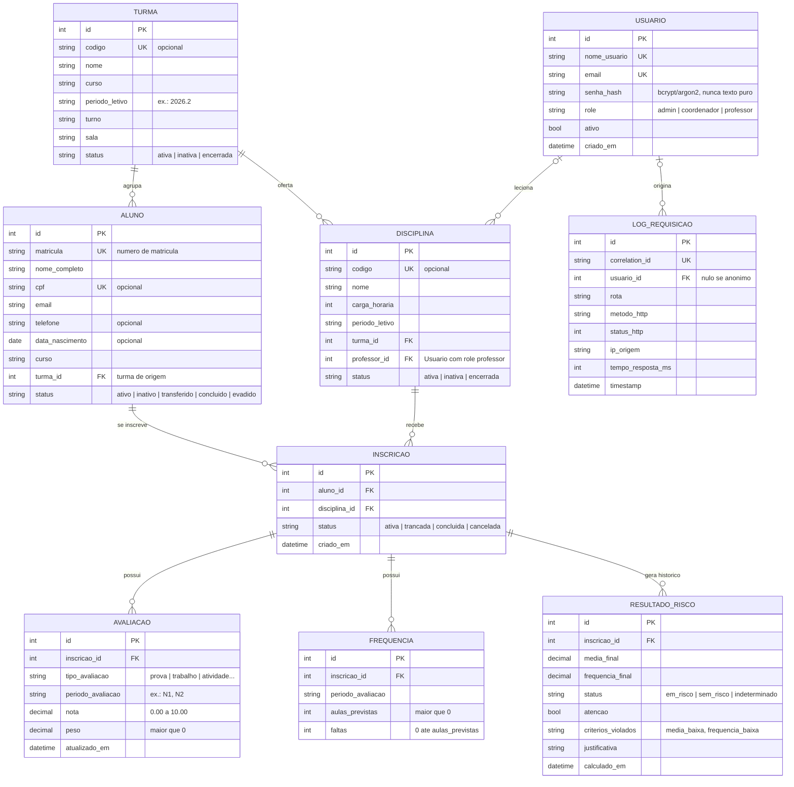

# DER — Diagrama Entidade-Relacionamento do SIMPA

Baseado no SRS v1.0.0 e nas decisões registradas em [`decisoes.md`](decisoes.md).

## Como ler as cardinalidades

| Símbolo | Significado |
|---|---|
| `\|\|` | exatamente um (obrigatório) |
| `\|o` | zero ou um (opcional) |
| `o{` | zero ou muitos |

Exemplo: `TURMA ||--o{ ALUNO` significa que todo aluno pertence a exatamente uma turma e que uma turma tem zero ou mais alunos.

## Restrições que o banco deve garantir (RNF08)

| Tabela | Restrição | Origem |
|---|---|---|
| aluno | `UNIQUE(matricula)`, `UNIQUE(cpf)` (permite nulo) | RF01 |
| turma, disciplina | `UNIQUE(codigo)` (permite nulo) | RF02 |
| usuario | `UNIQUE(email)`, `UNIQUE(nome_usuario)` | RF09 |
| inscricao | `UNIQUE(aluno_id, disciplina_id)` | D01 |
| avaliacao | `CHECK(nota BETWEEN 0 AND 10)`, `CHECK(peso > 0)` | RF03 |
| frequencia | `CHECK(aulas_previstas > 0)`, `CHECK(faltas BETWEEN 0 AND aulas_previstas)`, `UNIQUE(inscricao_id, periodo_avaliacao)` | RF03, D02 |
| todas as FKs | `ON DELETE RESTRICT` (sem exclusão física com histórico) | Restrição 3 |

## O que fica de fora do banco (e por quê)

- **Indicadores estatísticos (RF05):** são calculados sob demanda no `services/`. Guardá-los criaria dados duplicados que podem ficar desatualizados.
- **`frequencia_percentual`:** é derivado de `faltas` e `aulas_previstas` (D02).
- **`ResultadoRisco`** é a exceção. Ele é persistido porque o RF07 exige registrar o critério violado, e o histórico permite ver a evolução do aluno.

## Regras que o banco NÃO garante sozinho (ficam no service)

- Não lançar nota ou frequência em uma disciplina ou turma `encerrada` (D10).
- Só o professor da disciplina pode lançar notas nela (D03).
- Recalcular o `ResultadoRisco` a cada alteração de avaliação ou frequência (RF03).
- Validar a sintaxe do CPF (dígitos verificadores) (RF01).
